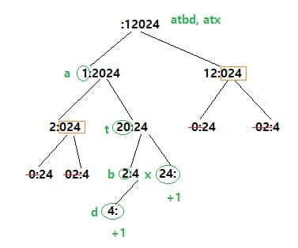

# dp ( Dynamic Programming )
	3가지 조건
	1. Problem이 SubProblem 으로 쪼개질 때.
	2. SubProblem의 솔루션으로 더 큰 규모의 솔루션을 구할 수 있을 때.
	3. SubProblem이 겹칠 때! (memoization)
	
	피보나치	F(n) = F(n-1) + F(n-2)
	일반 recursive의 경우 2개로 나눠지며 n개의 층이 있기 때문에 O(2^N)t
	원하는 답이 큰 경우 stack overflow가 발생
	DP를 사용하면 O(N)t, O(N)s -> sliding O(1)s
	
# ClimbingStairs_70
	계단을 한 번에 1칸 또는 2칸을 올라갈 경우 n층까지 올라가는 경우의 수는?
	dp(n) = dp(n-1) + dp(n-2) : 피보나치와 동일
	O(N)t, O(1)s

# MinCostClimbingStairs_746
	계단을 한 번에 1칸 또는 2칸을 올라가는데 계단에 비용이 있을 경우, 최소 비용으로 계단 올라가는 문제
	dp(n) = cost(n) + min( dp(n-2), dp(n-1) )
	결과는 계단 밖이라서 min ( dp(n-2), dp(n-1) )
	
	O(N)t, O(1)s 배열을 그대로 사용 가능 또는 3개 공간 sliding
	
# MinimumPathSum_64
	매트릭스 좌상단에서 우하단으로 가는 최소 비용 구하기
	1. 첫 행과 첫 열의 최소 비용을 기본적으로 채워주기
	2. dp[x][y] = cost[x][y] + Math.min(dp[x - 1][y], dp[x][y - 1]);
	O(N)t, O(1)s 배열을 그대로 사용 가능
		
# CoinChange_322
	주어진 동전들의 합이 target을 만드는 최소 동전 개수를 구하는 문제
	ex) coins, target = n
	dp[n] = 유효값 존재 시 ? "min( for(dp[n - coins[i]]) ) + 1" : "-1"
	
# DecodeWays_91
	인코딩된 숫자 어레이를 디코딩 하는 방법의 개수를 구하는 문제
	ex )	2,6 -> z || b, f
			2,2,3 -> b, b, c, || b, w || vc
			
	dp[n] =
	+ number(n) ? dp[n-1] : 0
	+ number(n-1, n) ? dp[n-2] : 0

	recursive
